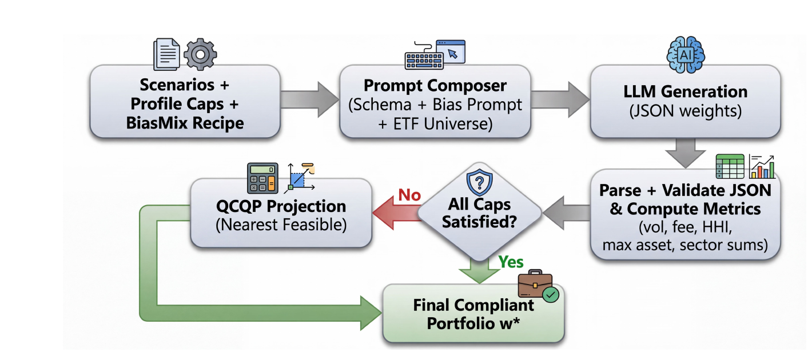

# BiasMix-Finance: Post-Generation KYC Guardrails for LLM Portfolio Advice

**Supplementary repository for the paper:** *BiasMix-Finance: Post-Generation KYC Guardrails for LLM Portfolio Advice*

BiasMix-Finance is a compact benchmark and reproducibility package for studying how large language models generate ETF portfolio allocations under biased prompts, and how deterministic post-generation guardrails can verify and repair those allocations against KYC-style numeric constraints.

This repository contains the dataset, prompts, caps, code notebooks, and canonical outputs needed to reproduce the paper's tables and figures.

> **Note:** This project is for research and reproducibility only. It is not financial advice, investment advice, or a production robo-advisor.

---

## Overview

LLMs can produce plausible-looking portfolio recommendations that silently violate constraints such as risk, fee, diversification, single-asset exposure, or sector concentration. BiasMix-Finance treats the LLM output as an **auditable draft**, not a final action.

The pipeline:

1. Composes a scenario using an investor risk profile, KYC-style caps, an ETF universe, and a bias-inducing prompt.
2. Asks an LLM to emit portfolio weights under a strict JSON schema.
3. Validates the draft allocation against hard numeric caps.
4. Repairs violating allocations using a nearest-feasible convex QCQP projection.
5. Logs before/after metrics so the recommendation can be audited.



*Figure: BiasMix-Finance post-generation guardrail pipeline. © 2026 BiasMix-Finance Authors.*
---

## Key results from the paper

Across three LLM backends and three prompting modes, first-pass generations frequently violated at least one cap on the held-out test split. Prompting strategies such as critique and self-consistency reduced some violations but did not guarantee compliance.

| Finding | Result |
|---|---:|
| Test first-pass any-cap violation range | 47.6% - 85.7% |
| Pooled first-pass violation rate | 67.2% |
| Post-projection final feasibility | 100% in reported runs |
| Pooled median correction distance | D = 0.066 |
| Parse failures on held-out test | 0 with strict JSON + retries |

The main takeaway is that **prompting alone is not reliable enough for hard numeric constraints**, while deterministic verify-and-repair can enforce final feasibility when the cap set is feasible.

---

## What is included

```text
notebooks/
  BiasMix_Finance_Post_Generation_KYC_Guardrails.ipynb
  eda_universe_diagnostics.ipynb

data/
  scenarios_full.jsonl       # 72 BiasMix scenarios across profiles, bias recipes, and seeds
  assets.csv                 # 16-ETF universe metadata
  sigma.npy                  # covariance matrix used for risk calculation/projection

outputs/
  results.jsonl              # canonical paper run outputs for exact reproduction
```

The 16-ETF universe used in the paper is:

```text
SPY, VEA, VWO, VGT, XLE, XLF, XLV, XLY, XLP, XLI, XLRE, IWM, AGG, LQD, IEF, GLD
```

The scenario suite combines:

- 3 risk profiles: Conservative, Moderate, Aggressive
- 8 bias recipes: anchor tech, default inertia, EM tilt, FOMO energy, fee neglect, gold craze, small-cap hype, US-only bias
- 3 random seeds per profile/bias cell
- 72 total scenarios split into train/dev/test

---

## Reproducibility modes

There are two ways to use this repository.

### Mode A: Exact reproduction, no LLM calls

Use this mode to reproduce the paper's reported metrics, tables, and figures from the canonical `outputs/results.jsonl` file.

Recommended for reviewers and readers who want deterministic reproduction.

Steps:

1. Open `notebooks/BiasMix_Finance_Post_Generation_KYC_Guardrails.ipynb` in Google Colab or Jupyter.
2. Make sure these files are available to the notebook:
   - `data/scenarios_full.jsonl`
   - `data/assets.csv`
   - `data/sigma.npy`
   - `outputs/results.jsonl`
3. Run the notebook sections for loading data, statistical evaluation, and figure/table generation.

Typical outputs:

```text
tables/violation_overall.csv
tables/violations_summary.csv
tables/distance_D_mean_CI.csv
tables/delta_sigma_CI.csv
tables/delta_waer_CI.csv
tables/delta_hhi_CI.csv
tables/wilcoxon_model_pairs_fdr.csv
```

Main generated figures include:

```text
violation_rate.pdf
correction_distance.pdf
violation_severity.pdf
```

### Mode B: End-to-end rerun with LLM calls

Use this mode to rerun prompting, parsing, validation, projection, and evaluation.

This requires API keys. Results may differ from the paper because LLM generation is stochastic and provider model versions may change.

Supported provider setup in the notebook:

```text
GOOGLE_API_KEY              # Gemini backend
OPENAI_API_KEY              # OpenAI backend
OPENAI_COMPAT_API_KEY       # OpenAI-compatible hosted model backend
OPENAI_COMPAT_BASE_URL      # OpenAI-compatible hosted model endpoint
```

The full grid evaluates:

```text
models = primary, secondary_closed, secondary_open
modes  = direct, critique, self-consistency
splits = train, dev, test
```

---

## Method summary

Given a draft portfolio `w0`, the guardrail checks:

- nonnegative weights
- weights sum to 1
- annualized volatility cap
- weighted-average expense ratio cap
- HHI concentration cap
- maximum single-asset weight
- maximum sector weight

If a draft violates any cap, the repair layer solves a nearest-feasible projection:

```text
minimize    ||w - w0||^2 + lambda * w^T Sigma w
subject to  w is a valid portfolio and satisfies all caps
```

The correction distance `D = ||w* - w0||2` is used as an audit signal: small values indicate a light nudge, while larger values indicate stronger constraint-forced rebalancing.

---

## Suggested repository usage

For exact reproduction:

```bash
# Clone the repository
git clone https://github.com/gauravkukreja06/biasmix-finance.git
cd biasmix-finance

# Open the notebook in Jupyter or Colab
# Then run the exact reproduction path using outputs/results.jsonl
```

For local execution, install the packages used by the notebook as needed:

```bash
pip install numpy pandas scipy matplotlib cvxpy osqp scs
```

Additional provider SDKs may be required only for Mode B, depending on which LLM backends you enable.

---

## Repository status

This repository is intended to support reproducibility for the paper. The canonical paper numbers should be reproduced using `outputs/results.jsonl`. Fresh end-to-end LLM runs are useful for extension experiments, but they should not be expected to exactly match the paper tables.

---

## Citation

If you use this repository, please cite the paper. Update the entry below once the arXiv or proceedings version is available.

```bibtex
@misc{kukreja2026biasmixfinance,
  title        = {BiasMix-Finance: Post-Generation KYC Guardrails for LLM Portfolio Advice},
  author       = {Kukreja, Gaurav and Kukreja, Parul and Abraar, Mohammed and Dandekar, Raj and Dandekar, Rajat and Panat, Sreedath},
  year         = {2026},
  note         = {Code and data available at https://github.com/gauravkukreja06/biasmix-finance}
}
```

---

## License

The code in this repository is released under the MIT License. See the `LICENSE` file for details.

The accompanying paper, manuscript text, figures, and any paper-specific content are governed by the license selected for the paper/preprint submission and are not automatically covered by the repository code license unless explicitly stated.

---

## Contact

For questions about the reproducibility package, please open a GitHub issue or contact the authors through the information listed in the paper.
